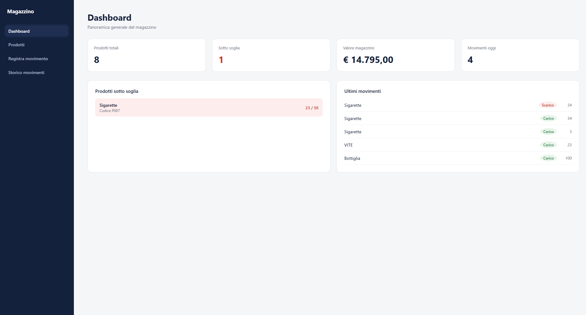
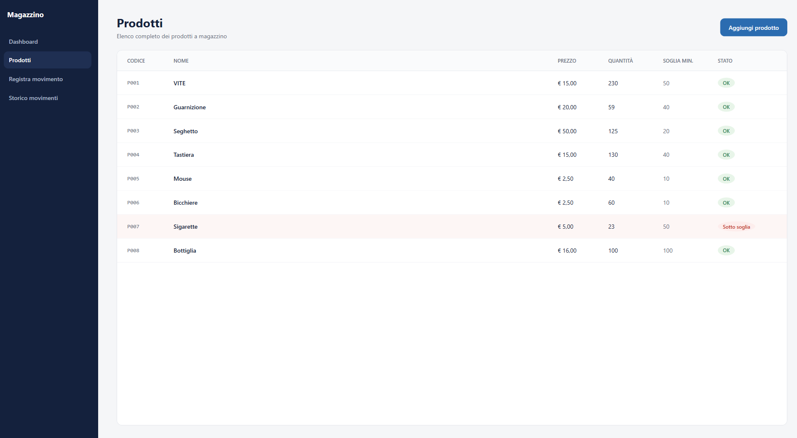
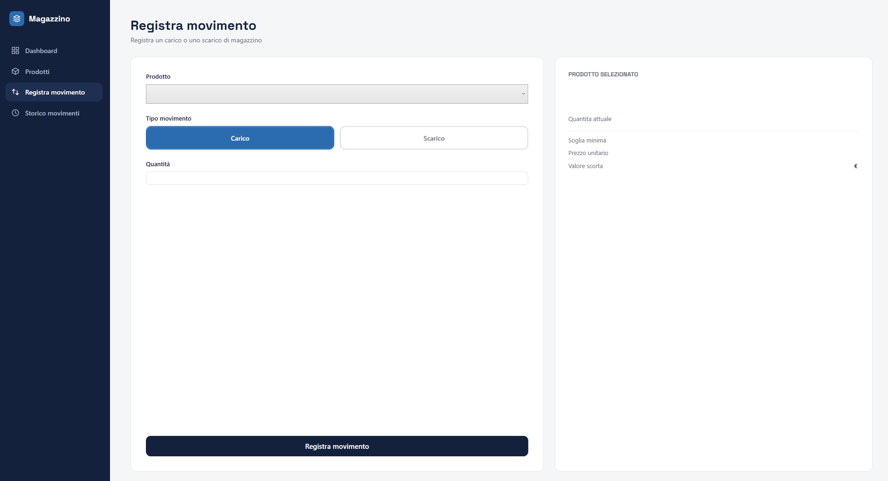
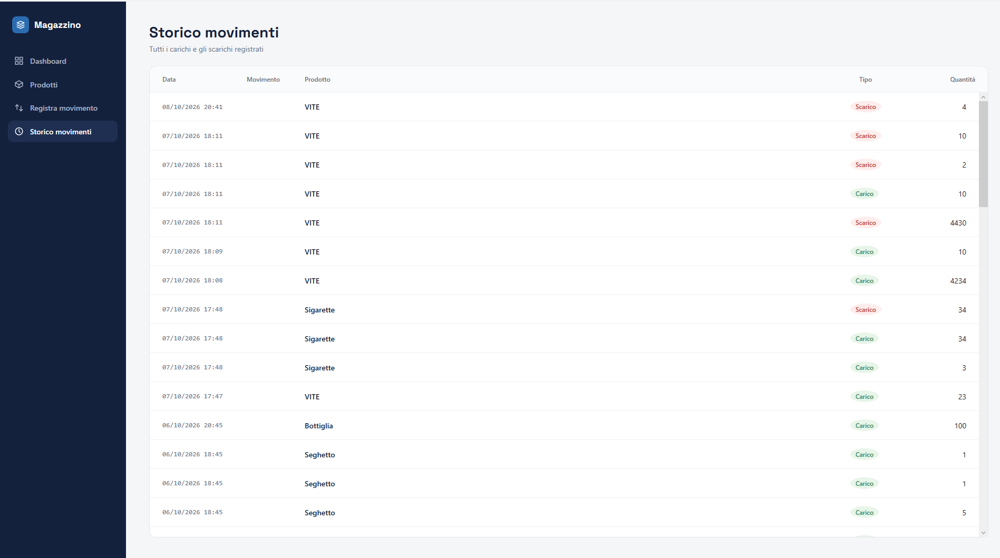

# Gestione Magazzino
 
Applicazione per la gestione di un magazzino: prodotti, movimenti di carico e scarico, controllo delle scorte minime. Lo stesso backend è usato da due interfacce, una console e una desktop in WPF.
 

 
## Funzionalità
 
- **Dashboard**: numero di prodotti, prodotti sotto soglia, valore totale del magazzino, movimenti del giorno, elenco dei prodotti sotto soglia e ultimi movimenti.
- **Prodotti**: tabella di tutti i prodotti con lo stato della scorta (OK / Sotto soglia) e inserimento di un nuovo prodotto.
- **Registra movimento**: carico o scarico di un prodotto, con un pannello che mostra quantità, soglia, prezzo e valore della scorta aggiornati in tempo reale.
- **Storico movimenti**: tutti i movimenti registrati, dal più recente.
- **Avvisi**: conferma del movimento registrato e avviso quando un prodotto scende sotto la soglia minima.
- **Controlli sui dati**: codice prodotto duplicato, prezzo e quantità non validi, scorta insufficiente per uno scarico.
- **Salvataggio automatico** su file JSON. Console e WPF leggono e scrivono gli stessi dati.
  
| Prodotti | Registra movimento | Storico movimenti |
|---|---|---|
|  |  |  |
 
## Tecnologie
 
- C# / .NET 10
- WPF con pattern MVVM
- System.Text.Json per la persistenza
- Nullable reference types attivi in tutta la soluzione
## Struttura della soluzione
 
```
GestioneMagazzino.sln
├── GestioneMagazzino.Core     Libreria con tutta la logica: modelli, servizi, repository, eventi, eccezioni
├── GestioneMagazzino          Interfaccia console (menu testuale)
├── GestioneMagazzino.Wpf      Interfaccia desktop (Views, ViewModels, Commands)
└── GestioneMagazzino.Tests    Test automatici
```
 
Il progetto è nato come applicazione console. Per aggiungere l'interfaccia grafica ho spostato la logica in una libreria separata (`Core`), così console e WPF la condividono senza duplicare codice.
 
## Scelte tecniche
 
**MVVM scritto a mano.** Non ho usato librerie MVVM: `ViewModelBase` (con `INotifyPropertyChanged`) e `RelayCommand` (con `ICommand`) sono scritti da me, per capire cosa fanno prima di affidarmi a un framework. La navigazione tra le pagine usa un `ContentControl` collegato al ViewModel corrente e un `DataTemplate` per ogni coppia ViewModel/View.
 
**Un solo backend per due interfacce.** `ServizioMagazzino` contiene tutte le regole. Le interfacce si limitano a raccogliere i dati e a mostrare i risultati.
 
**Eventi.** Il servizio pubblica due eventi, `MovimentoRegistrato` e `ScortaBassa`. La console li usa per stampare un messaggio, il ViewModel per mostrare conferma e avviso a video. Il servizio non sa chi lo ascolta.
 
**Disiscrizione dagli eventi.** I ViewModel vengono ricreati a ogni cambio pagina, mentre il servizio vive quanto l'applicazione. Un ViewModel iscritto a un evento resterebbe in memoria e continuerebbe a rispondere anche dopo essere stato sostituito. Per questo il ViewModel implementa `IDisposable` e si disiscrive quando la pagina cambia.
 
**Validazione su due livelli.** Il ViewModel controlla il formato (campo vuoto, testo che non è un numero). Il servizio controlla le regole di business (codice duplicato, prezzo o quantità non validi, scorta insufficiente) e le segnala con eccezioni, alcune delle quali personalizzate (`ScortaInsufficienteException`, `ProdottoGiaEsistenteException`). In questo modo le regole valgono allo stesso modo per console e WPF.
 
**Repository generico.** `Repository<T>` gestisce qualsiasi entità che implementi `IIdentificabile` e si occupa di salvataggio e caricamento su file JSON.
 
## Come eseguirlo
 
Requisiti: Windows e .NET 10 SDK.
 
```
git clone https://github.com/Aamonsd/gestione-magazzino.git
cd gestione-magazzino
```
 
Interfaccia desktop:
 
```
dotnet run --project GestioneMagazzino.Wpf
```
 
Interfaccia console:
 
```
dotnet run --project GestioneMagazzino
```
 
Test:
 
```
dotnet test
```
 
I dati vengono salvati in `%LocalAppData%\GestioneMagazzino` (`prodotti.json` e `movimenti.json`).
 
## Possibili sviluppi
 
- Modifica ed eliminazione dei prodotti.
- Ricerca e filtri nelle tabelle.
- Stato della voce selezionata nel menu gestito dal ViewModel invece che dalla View.
 

